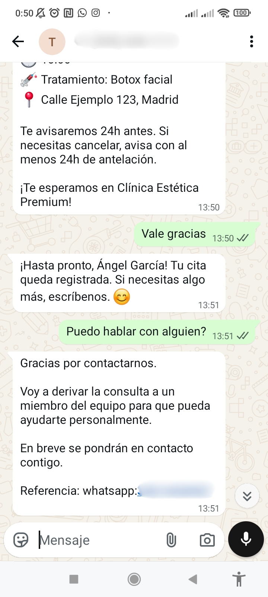

# 🏥 Omnichannel AI Scheduler — Aesthetic Clinic

> AI-powered omnichannel appointment scheduling system for aesthetic clinics. Built with n8n, Gemini AI, WhatsApp Business API, Instagram DM, Facebook Messenger, Google Calendar and Google Sheets. Automates bookings, cancellations, rescheduling and human escalation without manual intervention.

---

## 🎯 What does it do?

Omnichannel appointment management system for aesthetic clinics. Patients can interact via **WhatsApp, Instagram or Facebook Messenger** to:

| Feature | Description |
|---------|-------------|
| **Book appointment** | Patient requests an appointment, bot collects data (name, phone, age) and shows real availability from Google Calendar |
| **Confirm appointment** | After selecting a time slot, patient confirms and bot creates the event in Calendar |
| **Reschedule appointment** | Patient can change their appointment to another available time slot |
| **Cancel appointment** | Patient cancels their existing appointment |
| **Human escalation** | If patient needs to speak to a person, bot escalates to staff and automatically silences itself |
| **Medical triage** | Verifies age and health conditions before booking |
| **Reset conversation** | User can type `reset` to clear all context |

---

## ✨ Key Features

| Feature | Description |
|---------|-------------|
| **True omnichannel** | WhatsApp Business API, Instagram DM, Facebook Messenger |
| **Multi-turn conversational AI** | Persistent context across sessions using cache + Google Sheets |
| **State machine** | 9 stages (inicio, triaje, recopilando_nombre, recopilando_telefono, mostrando_slots, confirmando_cita, agendado, cancelado, escalar) |
| **Real availability** | Queries Google Calendar in real time, shows free slots |
| **Double confirmation protection** | Prevents duplicates if user responds "yes" multiple times |
| **Medical triage** | Verifies age (≥18) and conditions (pregnancy, anticoagulants, allergies) |
| **Human takeover** | Silences bot for 30 minutes when a human takes control |
| **Full reset** | `reset` command clears cache and Sheets context |
| **Lead scoring** | Scores each lead based on intent (HOT 70-100, WARM 40-69, COOL 15-39, COLD 0-14) |
| **Rate limiting** | 8 messages per minute per conversation |
| **Echo filtering** | Prevents loops with bot's own messages |

---

## 🏗️ Architecture

Webhook (WhatsApp / Instagram / Facebook)
│
└── Parse Webhook (normalizes formats)
│
└── Rate Limiter (8 msg/minute)
│
└── Resolve Cross-Channel Identity (unique patient_id + conversation_id)
│
└── Human Takeover IF (human_takeover = TRUE silences bot)
│
└── Multi-turn State Machine
│
├── BOOK → Check Calendar availability → Create event
│
├── CANCEL → Cancel Calendar event
│
├── RESCHEDULE → Show new slots → Reschedule
│
├── ESCALATE → Set human_takeover flag + Email staff
│
└── RESPOND → Gemini AI classifies intent
│
└── Prepare Response → Save context
│
├── Send message (WhatsApp / Instagram / Facebook)
│
├── Save to Sheets (Context, Patients, CRM_Inbox)
│
├── Update Metrics (leads, appointments, escalations)
│
└── Sync GHL (contact, opportunity, note)

text

---

## 🧠 State Machine Stages

| Stage | Description | Next on ✅ | Next on ❌ |
|-------|-------------|----------------|----------------|
| **inicio** | Classifies intent with Gemini | `BOOK` → `triaje` | `OTHER` → responds and waits |
| **triaje** | Asks age, detects contraindications | Age ≥18 → `collecting_name` | Contraindication → `escalate` |
| **collecting_name** | Asks for full name | Valid name → `collecting_phone` | Invalid → repeats |
| **collecting_phone** | Asks for phone, normalizes to 34XXXXXXXXX | Valid phone → `showing_slots` | Invalid → repeats |
| **showing_slots** | Shows up to 6 free Calendar slots | Chooses number → `confirming_appointment` | "change" → other slots |
| **confirming_appointment** | Summary + "Confirm? YES/NO" | "YES" → `booked` | "NO" → `showing_slots` |
| **booked** | Creates Calendar event + notifies | "cancel" → `confirming_cancellation` | "thanks" → goodbye |
| **confirming_cancellation** | "Confirm cancellation? YES/NO" | "YES" → `cancelled` | "NO" → `booked` |
| **cancelled** | Deletes event, clears metadata | New appointment → `showing_slots` | Goodbye → `inicio` |
| **escalate** | Escalates to human | Email to staff, bot silenced for 30min | Staff resolves → `inicio` |

---

## 🛠️ Tech Stack

| Tool | Purpose |
|------|---------|
| [N8N](https://n8n.io) | Workflow orchestration and automation |
| [Gemini AI](https://ai.google.dev) | Intent classification (BOOK, CANCEL, RESCHEDULE, ESCALATE, OTHER) |
| [WhatsApp Business API](https://developers.facebook.com/docs/whatsapp) | Inbound and outbound messaging |
| [Instagram DM API](https://developers.facebook.com/docs/instagram) | Instagram messaging |
| [Facebook Messenger API](https://developers.facebook.com/docs/messenger-platform) | Facebook messaging |
| [Google Calendar](https://calendar.google.com) | Appointment management and availability |
| [Google Sheets](https://sheets.google.com) | Context persistence, patients, CRM and metrics |
| [Gmail](https://gmail.com) | Staff notifications (appointments, escalations, cancellations) |
| [GoHighLevel / LeadConnector](https://gohighlevel.com) | External CRM (contact, opportunity, note) |

---

## 📸 Screenshots

| Workflow overview | Metrics dashboard | WhatsApp example | Instagram example |
|---|---|---|---|
|  |  |  |  |

| Facebook example | Confirmation email | GHL Contacts | GHL Opportunities |
|---|---|---|---|
|  |  |  |  |

| Google Sheets Context | Google Calendar Event | Gemini AI Node | GHL Nodes in n8n |
|---|---|---|---|
|  |  |  |  |

---

## 📁 Project Structure

omnichannel-ai-scheduler/
├── README.md
├── LICENSE
├── workflow/
│   ├── omnichannel-scheduler.json
│   └── meta-webhook-verification.json
├── templates/
│   ├── Omnichannel AI Scheduler — Aesthetic Clinic.xlsx
│   ├── Omnichannel_CRM_Enterprise.xlsx
│   └── build_sheets.py
├── docs/
│   ├── .env.example
│   ├── GHL_INTEGRATION.md
│   └── SECURITY.md
└── assets/
    ├── dashboard/
    ├── conversations/
    ├── google_sheets/
    ├── google_calendar/
    ├── ghl/
    ├── email/
    └── n8n/

---

## 🚀 Setup Guide

### 1. Prerequisites

- N8N instance (self-hosted v2.10+ or N8N Cloud)
- Meta for Developers account with access to:
  - WhatsApp Business API
  - Instagram Graph API
  - Facebook Messenger Platform
- Google account (Sheets + Calendar + Gmail)
- Google AI Studio account (Gemini API key)
- GoHighLevel / LeadConnector (optional)

### 2. Configure N8N Credentials

| Credential | Where to get it |
|------------|------------------|
| `GEMINI_API_KEY` | [aistudio.google.com](https://aistudio.google.com) |
| `META_ACCESS_TOKEN` | Meta for Developers → Your App → WhatsApp → API Settings |
| `META_PAGE_ACCESS_TOKEN` | Meta for Developers → Your App → Instagram → Page Access Token |
| `WHATSAPP_PHONE_NUMBER_ID` | Meta for Developers → WhatsApp → API Settings |
| `META_IG_PAGE_ID` | Meta for Developers → Instagram → Linked Accounts |
| `META_FB_PAGE_ID` | Meta for Developers → Facebook → Page |
| `META_BOT_PSID` | Page ID (prevents bot echo) |
| Google Sheets OAuth | N8N built-in OAuth |
| Google Calendar OAuth | N8N built-in OAuth |
| Gmail OAuth | N8N built-in OAuth |
| `GHL_ACCESS_TOKEN` | GoHighLevel → Settings → API → Access Token |
| `GHL_LOCATION_ID` | GoHighLevel → Settings → Location |

### 3. Upload Google Sheets Template

1. Upload `Omnichannel AI Scheduler — Aesthetic Clinic.xlsx` to Google Drive
2. Copy the **Sheet ID** from the URL:

https://docs.google.com/spreadsheets/d/YOUR_SHEET_ID_HERE/edit

3. Update the `documentId` in all Google Sheets nodes in the workflow

### 4. Import Workflow to N8N

In N8N: menu `...` → **Import from file** → select:
- `workflow/omnichannel-scheduler.json` (main workflow)
- `workflow/meta-webhook-verification.json` (webhook verification)

### 5. Configure Meta Webhooks

| Channel | Webhook URL |
|---------|-------------|
| WhatsApp | `https://your-n8n.com/webhook/omnichannel-webhook` |
| Instagram | `https://your-n8n.com/webhook/omnichannel-webhook` |
| Facebook | `https://your-n8n.com/webhook/omnichannel-webhook` |

**Verify token:** Configure it in your environment variables and in Meta.

### 6. Activate Workflow

Toggle the workflow to **Active** in N8N.

---

## 📊 Google Sheets Structure

### Context Sheet

| Column | Description |
|--------|-------------|
| `conversation_id` | Unique ID per conversation |
| `from` | Sender ID/phone number |
| `channel` | whatsapp / instagram / facebook / test |
| `stage` | Current stage (inicio, triaje, booked, etc.) |
| `history` | Last 20 conversation turns |
| `metadata` | JSON with name, phone, age, treatments, aptitudVerificada |
| `appointment_confirmed` | TRUE / FALSE |

### Patients Sheet

| Column | Description |
|--------|-------------|
| `patient_id` | Unique patient ID |
| `normalized_phone` | 34XXXXXXXXX — cross-channel search key |
| `name` | Full name |
| `origin_channel` | First channel used |
| `confirmed_appointments` | Counter of completed appointments |

### CRM_Inbox Sheet

| Column | Description |
|--------|-------------|
| `event_type` | APPOINTMENT_CONFIRMED / ESCALATED / APPOINTMENT_CANCELLED |
| `patient_name` | Patient name |
| `service` | Requested treatment |
| `calendar_event_id` | Google Calendar event ID |

### Metrics Sheet

| Column | Description |
|--------|-------------|
| `total_leads` | Total conversations |
| `qualified_leads` | Intent to book |
| `booked_appointments` | Confirmed appointments |
| `escalations` | Cases escalated to human |

### Interventions Sheet

| Column | Description |
|--------|-------------|
| `conversation_id` | Intervened conversation ID |
| `active` | TRUE = bot silenced / FALSE = bot active |

---

## 🔧 Key Workflow Nodes

| Node | Function |
|------|----------|
| `Parse Webhook` | Normalizes payloads from WhatsApp, Instagram, Facebook and Test |
| `Rate Limiter` | 8 messages per minute per conversation |
| `Resolve Cross-Channel Identity` | Generates unique patient_id and conversation_id |
| `Human Takeover IF` | Silences bot if human_takeover = TRUE (30 min) |
| `Control Sheets Reading` | Decides whether to use Sheets or cache |
| `Calculate Free Slots` | Calculates available slots in Google Calendar |
| `Gemini AI - Central Brain` | Classifies message intent |
| `Multi-turn State Machine` | Core state machine engine |
| `Action Router` | Routes by action (BOOK, ESCALATE, RESPOND, CANCEL) |
| `Prepare Final Response` | Unifies message and final context |
| `Save Context Cache` | Persists state in memory (n8n vars) |
| `Save Context Sheets` | Persists state in Google Sheets |
| `Send Staff Email Gmail` | Notifies staff about appointments and escalations |
| `GHL Upsert Contact` | Syncs contact with GoHighLevel |

---

## 🛡️ Security

- All API keys and tokens must be stored as **environment variables** — never hardcoded
- `SECURITY.md` details what should never be committed (tokens, pinData, real data)
- Webhook verification endpoint handles Meta's challenge-response authentication
- Rate limiting per conversation prevents abuse
- Empty message and "read" event filtering prevents loops

---

## 📄 License

MIT License — free for personal and commercial use.

---

## 🤝 Contributing

Pull requests are welcome. For major changes, please open an issue first to discuss what you would like to change.

---

## 👤 Author

**Alejandro Peralta** — Process Automation Specialist

- GitHub: [@alejandro-orbis](https://github.com/alejandro-orbis)
- LinkedIn: [linkedin.com/in/alejandro-orbis](https://linkedin.com/in/alejandro-orbis)
- Email: [alejandro@orbisautomations.com](mailto:alejandro@orbisautomations.com)

---

*Built with ❤️ using [n8n](https://n8n.io), [Google Gemini](https://deepmind.google/technologies/gemini/) and the Meta Business API.*

*Created to eliminate repetitive appointment management work — so clinics can focus on what really matters: their patients.*
